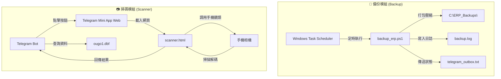

# ⚠️ [未完成 - 審查與討論中] ERP 系統自動備份與 Telegram Mini App 掃碼功能 - 開發實作計劃書

本計劃書包含兩項核心功能的開發規劃：
1. **💾 系統自動備份模組**：自動化打包備份 VFP DBF 資料庫與外掛程式碼，支援排程與 Telegram 完成通知。
2. **📷 Telegram Mini App 實時相機掃描條碼**：在 Telegram 內嵌開啟相機網頁，秒掃條碼並自動回傳 ERP 庫存查詢結果。

---

## ⚠️ 需要您審查的決策 (User Review Required)

> [!IMPORTANT]
> **備份容量與檔案鎖定問題**
> - **檔案鎖定**：VFP 的 DBF 檔案在 ERP 運行中常處於共享讀寫狀態。備份程式會使用「複製（Copy-Item）」直接抓取。若有極少數大檔案因獨佔鎖定無法複製，備份會跳過該檔並在日誌與 Telegram 中發出警告。
> - **備份空間**：預設會在 `C:\ERP_Backups\` 保留最近 7 天的壓縮檔，舊的會自動刪除，防止硬碟空間爆滿。

> [!WARNING]
> **相機掃描網頁的 HTTPS 安全需求**
> - 手機瀏覽器（如 Safari、Chrome）規定必須在 **HTTPS 網路連線（安全連線）** 下才允許開啟手機相機。
> - 目前本機 Web 服務是透過 Localtunnel 分配的 HTTPS 外網連結，因此實作掃碼網頁時，必須確保主機的 Localtunnel 服務維持在線，手機才能正常調用鏡頭。

---

## ❓ 待釐清的問題 (Open Questions)

> [!IMPORTANT]
> 1. **備份目的地**：除了本機 `C:\ERP_Backups\` 外，您是否需要備份檔同時抄寫到其他磁碟（例如隨身碟 `D:\` 或 `E:\`）？
> 2. **備份排程時間**：自動備份預設在每天凌晨 02:00 執行，您是否有更偏好的非營業時間？
> 3. **測試用條碼格式**：您的商品條碼是 standard Barcode (一維條碼，如 EAN-13, Code 128) 還是 QR Code (二維條碼)？這會影響我們掃碼套件的解碼參數調校。

---

## 🛠️ 提案修改與新增的檔案 (Proposed Changes)



### [💾 系統自動備份模組]

#### [NEW] [backup_erp.ps1](file:///C:/agy_Add_on/ERP_System/ai_assistant/backup_erp.ps1)
建立備份核心 PowerShell 腳本：
- 定義來源路徑：`C:\agy_Add_on\ERP_System\` (包含 DATA 子目錄)。
- 定義備份目的地：`C:\ERP_Backups\`。
- 壓縮為 `ERP_Backup_yyyyMMdd_HHmmss.zip`。
- 輪替機制：保留最新 7 個備份，刪除其餘舊檔。
- 完成後，寫入日誌並寫入 `telegram_outbox.txt`，通知管理者備份結果與檔案大小。

#### [MODIFY] [telegram_bridge.js](file:///C:/agy_Add_on/ERP_System/ai_assistant/telegram_bridge.js)
- 新增 `cmd === '備份'` 或 `cmd === 'backup'` 指令接口，允許管理者在 Telegram 輸入「備份」手動即時觸發 `backup_erp.ps1`。

---

### [📷 條碼掃描模組]

#### [NEW] [scanner.html](file:///C:/agy_Add_on/ERP_System/ai_assistant/scanner.html)
建立內嵌掃描網頁前端：
- 引入 `https://telegram.org/js/telegram-web-app.js` (Telegram SDK)。
- 引入開源解碼套件 `https://unpkg.com/html5-qrcode` (支援多種一維、二維條碼)。
- 調用手機後置鏡頭，並在網頁中顯示定位框。
- 解析成功後，播放嗶聲提示，透過 `Telegram.WebApp.sendData(result)` 將條碼數字傳回給 Bot，並關閉視窗。

#### [MODIFY] [take_server.js](file:///C:/agy_Add_on/take_server.js)
- 新增 Express 靜態路由，提供 `/scanner` 以加載 `scanner.html`。

#### [MODIFY] [telegram_bridge.js](file:///C:/agy_Add_on/ERP_System/ai_assistant/telegram_bridge.js)
- 調整選單與指令，當收到「掃描」或「盤點」指令時，回傳帶有 `WebAppInfo` 連結的鍵盤按鈕：
  ```javascript
  reply_markup: {
    inline_keyboard: [[
      { text: "📷 開啟相機掃描條碼", web_app: { url: "https://<localtunnel_url>/scanner" } }
    ]]
  }
  ```
- 當接收到網頁傳回的條碼（透過 Telegram 服務端事件），自動在背景讀取 VFP 資料庫並回傳查詢報表。

---

## 🧪 驗證與測試計畫 (Verification Plan)

### 自動化與腳本測試
1. **備份功能**：
   - 手動執行 `powershell -File C:\agy_Add_on\ERP_System\ai_assistant\backup_erp.ps1`。
   - 檢查 `C:\ERP_Backups\` 是否成功生成 ZIP 檔案。
   - 檢查 `telegram_outbox.txt` 與日誌是否輸出正確訊息。
2. **Web 掃描頁面**：
   - 使用 Chrome 開發者工具（模擬手機端並模擬相機視訊流），確認網頁能正常載入解碼庫，並解析模擬的條碼影像。

### 手動測試 (需要您配合)
1. **Telegram 備份測試**：
   - 在 Telegram 輸入「`備份`」，驗證約 5-10 秒內是否收到「備份成功，檔案大小為 XX MB，保留最近 7 份檔」的通知。
2. **相機掃描測試**：
   - 在 Telegram 輸入「`掃描`」，點擊彈出的「📷 開啟相機掃描條碼」按鈕。
   - 驗證手機是否彈出相機權限請求，並在允許後開啟鏡頭。
   - 對準手邊的商品條碼，驗證是否能成功發出「嗶」聲、自動關閉網頁，且機器人立刻回傳該商品的 ERP 資訊。
